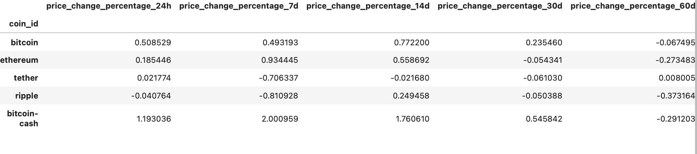
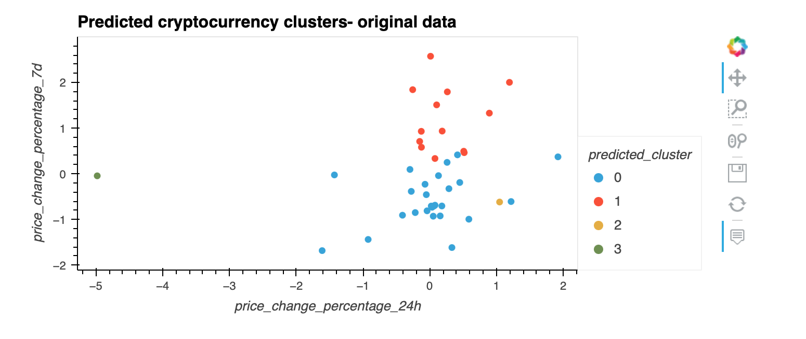
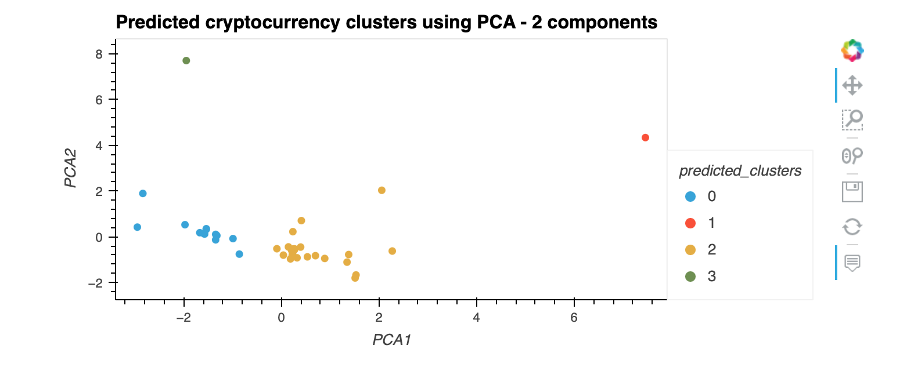

# Cryptocurrencies clustered by performance
This project proposes a novel approach to assembling investment portfolios that are based on cryptocurrencies. Instead of basing your proposal on only returns and volatility, it include other factors that might impact the crypto market—leading to better performance of the portfolio.
This project leverages financial Python programming skills with the  unsupervised machine learning algortihms to  cluster cryptocurrencies by their performance in different time periods. 
The results are being ploted using hvplot.

## Dataset
The data that is being analysed is being read from the CSV file and contains the percentage changes over the period of one year for various cryptocurrencies.



## Technologies 
This project leverages python 3.7 with the following packages:
* Pandas - for financial calculations
* Path - for identifying the file
* Matplotlib - for creation of visual graphs
* os- provides functions for interacting with the computer's operating system
* scikit - open source library that offers several algorithms for unsupervised machine learning
* hvplot - for dynamic visualisations


## Installation guide 
Thsi project leverages python 3.7 with the following dependencies:

``` python
pip install -U scikit-learn
conda install -c pyviz hvplot
```

## Import required libraries and dependencies 


## Usage 

Cryptocurrencies clustered by their performance leaveraging unsupervised machine learning and KMeans algorithms on original dataset:




Cryptocurrencies clustered by their performance leaveraging unsupervised machine learning and KMeans algorithms on two principal components:



## Contributors
Brought to you by Ksenia Gorska as part of the UC Berkeley Extension Bootcamp: UCB-VIRT-FIN-PT-06-2021-U-B-MW Ksenia Gorska
 e-mail: kseniagorska@icloud.com 
[linkedin] (https://www.linkedin.com/in/ksenia-gorska/)

## License

MIT